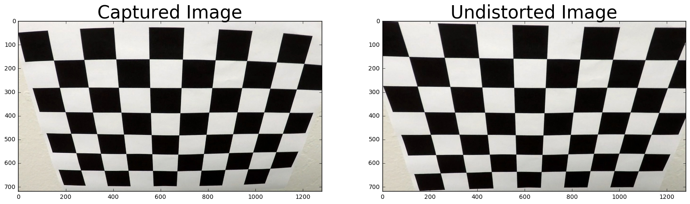
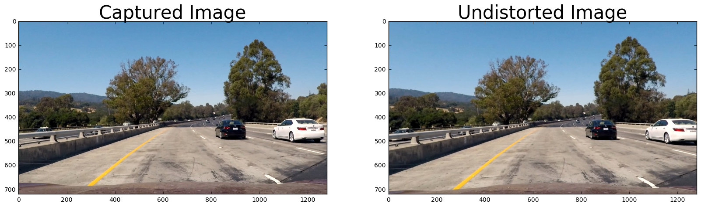
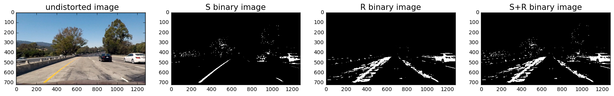
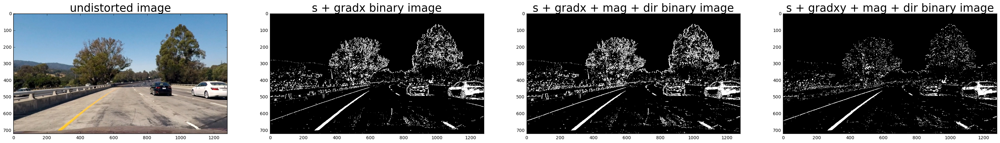
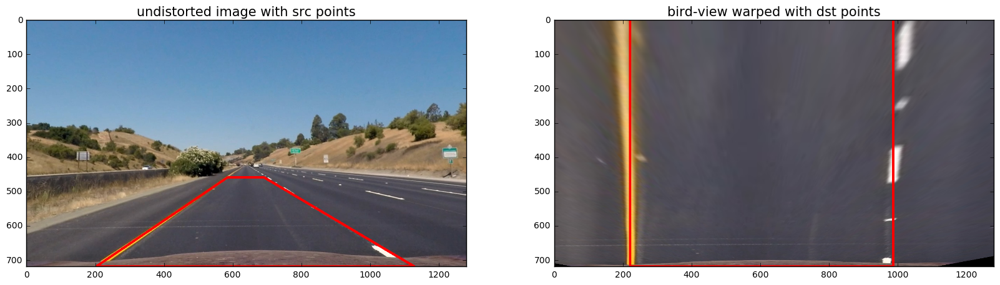
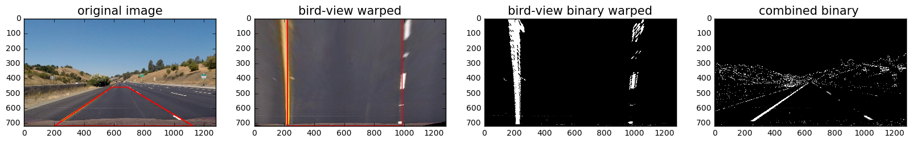
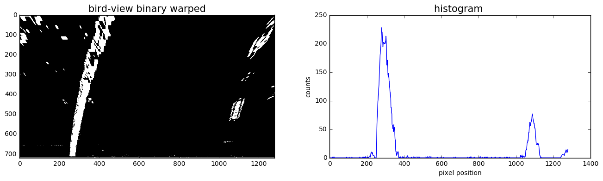
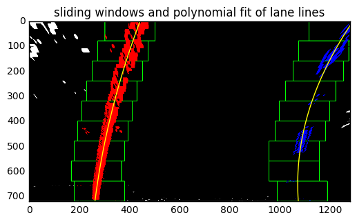
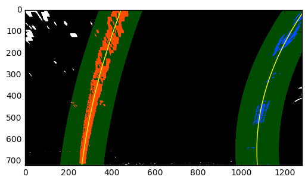
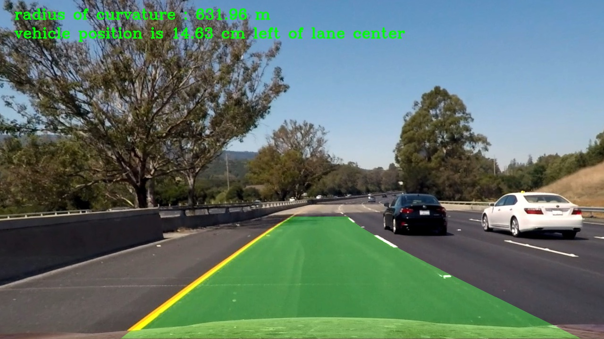

##Writeup
---

###Advanced Lane Finding Project###

***Objective***

The objective of this project is to find lane markings by developing algorithms for autonomous driving. This is advanced lane detecting 
project since the algorithms should be robust enough in finding the lanelines under varying light conditions,curvature of the road 
itself,vehicles on the road , condition of the road etc., The left and right lanes are to be detected from center camera mounted on
dashboard of the vehicle using advanced computer vision techniques.The outcome expected out of the project is to output visual display
of the lane boundaries, numerical estimation of lane curvature and vehicle position from lane center as displayed below.

Test image  |    Output image
:----------:|:-------------------------:
  |  

The goals / steps of this project are the following:

* Compute the camera calibration matrix and distortion coefficients given a set of chessboard images.
* Apply a distortion correction to raw images.
* Use color transforms, gradients, etc., to create a thresholded binary image.
* Apply a perspective transform to rectify binary image ("birds-eye view").
* Detect lane pixels and fit to find the lane boundary.
* Determine the curvature of the lane and vehicle position with respect to center.
* Warp the detected lane boundaries back onto the original image.
* Output visual display of the lane boundaries and numerical estimation of lane curvature and vehicle position.

##Camera Calibration

**1. Briefly state how you computed the camera matrix and distortion coefficients. Provide an example of a distortion corrected calibration image**

  The camera calibration and distortion correction code is contained in the **"undistort_camera.ipynb"** file.

Pre-requisite to do camera calibration: It requires calibration images which are already provided as /camera_cal/calibration*.jpg. The images were taken by camera keeping chessboard on flat surface and take from different angle, distance etc., . 
The computational code for camera calibration is divided as 2 steps.

The Step 1 code is 2nd code cell in above IPython notebook file

***Step 1: Read Calibration images,extract corners( 2D image points) and 3D objects points(real chessboard)***

i) Read in all calibration images using glob() API and stored as images.Each chessboard has 9 x 6 corners.

ii)Preparing "object points", which will be the (x, y, z) coordinates of the chessboard corners in the world. Here the  assumption is that the chessboard is fixed on the (x, y) plane at z=0, such that the object points are the same for each calibration image. Thus, objp is just a replicated array of coordinates, and "objpoints" will be appended with a copy of it every time when successfully detect all chessboard corners in a test image.

iii) The chessboard corners(2D image points i,e (x,y) pixel position of corners) for each calibration image is obtained using openCV function cv2.findChessboardCorners.The "imgpoints"  will be appended with the (x, y) pixel position of each of the corners in the image plane with each successful chessboard detection.
The "objpoints" and "imgpoints" are saved as pickled file for later use. 

***Step 2: Camera calibration given object points, image points, and the shape of the grayscale image***

The output objpoints and imgpoints are loaded from pickled file and the used to compute the camera calibration matrix "mtx" and distortion coefficients "dist" using the cv2.calibrateCamera() function. Saved the camera calibration result for later use.

**Apply a distortion correction to raw images**

I applied this distortion correction to the test image './camera_cal/calibration2.jpg' using the cv2.undistort() function and obtained this result. The code is contained under "Apply a distortion correction to raw images " markdown header.

##Pipeline (single images)

**1. Provide an example of a distortion-corrected image.**

To demonstrate this step, I will describe how I apply the distortion correction to one of the test images like this one:

Load camera calibration matrix "mtx" and distortion coefficients "dist" from pickled file as it pre-calculated in camera calibration module.Then read image test1.jpg using matplotlib image read as "img".It is in RGB format.Check the resolution of image to be undistorted is same as resolution of images used for calibration of camera. Used openCV API cv2.undistort(img, mtx, dist, None, mtx). Undistorted image is returned and plot the same. The corresponding code is contained in "undistort_camera.ipynb" file as last code cell.

**2. Describe how (and identify where in your code) you used color transforms, gradients or other methods to create a thresholded binary image. Provide an example of a binary image result.**

I have used combination of color and gradient thresholds.The code is contained in **"lane_lines_framewise_analysis.ipynb"**

***Color threshold:***The function color_threshold() in code cell:8 takes threshold range and image as inputs and provide binary image of S channel and R channel.Only S channel will be used for lane detection as R channel fails as it detects light gray part of the road also.The color thresholded image is displayed below:

***Gradient threshold:*** Three functions abs_sobel_thresh(),mag_thresh(),dir_threshold() are defined in code cells:5,6,7 respectively.
These gradient thresholds are combined with color threshold and applied on image.The result is displayed below:

The combined thresholded binary image (having gradient thesholded in x direction + in y direction + magnitude of gradient + direction of gradient) gives better result as seen above.The dirt of road has been filtered well compared with other combined binary image shown above. 

**3 .Describe how (and identify where in your code) you performed a perspective transform and provide an example of a transformed image.**

The code is contained in code cell:11 of **"lane_lines_framewise_analysis.ipynb"** file.The function which does perspective transform is defined as perspective_transform() which internally calls openCV function cv2.getPerspectiveTransform(). The src and dst points are hardcoded and called once to get the tranformation matrix 'M' and inverse trasform matrix 'Minv'. The src points are selected from ./test_images/straight_lines.jpg"  and the polygon drawn on the image is shown below.The dst points are calculated so that the lane lines(left and right) for warped(birds-view) image obtained through perspective transform is parallel.

      src = np.float32([[585,460],[695,460],[1127,720],[203,720]])  
      dst = np.float32([[220,0],[985,0],[985,720],[220,720]])  

The dst points particularly left bottom and right bottom are tuned such that the objects not between the lanes are avoided as much as possible as it was observed the side vehicles coming near the lane and boundary wall of the road introduce errors in lane detection 
The warped image with lane lines parallel is verified by plotting the images before warping and after warping.The code is contained in code cell:12  of **"lane_lines_framewise_analysis.ipynb"** file

**4. Describe how (and identify where in your code) you identified lane-line pixels and fit their positions with a polynomial?**

To identify the lane-line pixels, following the below steps:

i)The undistorted image is combine thresholded with  gradient and color to get combined binary image.Then the combined binary image is warped. This functionality is obtained using a function defined as **corners_unwarp()** which takes undistorted image as input and return binary warped image. The corresponding code is contained in code cell:12 of **"lane_lines_framewise_analysis.ipynb"** file. The output of displayed below shows all images what an undistorted image undergo in this pipeline:

ii) Lane-line pixel detection and curve polynomial fit icode is contained in code cell: of **"lane_lines_framewise_analysis.ipynb"** file. Now it is seen that binary warped image has lane lines displayed in easy form for detection.First the lane-line pixels are to be identified i.e to decide explicitly which pixels are part of the lines and which belong to the left line and which belong to the right line. The function **polynomial_fit()** defined takes binary warped image as input.In this function, first computing histogram of lower half of image(binary warped) as the peaks will be good indicators of x-position of lane lines starting point.For example test6.jpg image,displayed the binary warped image and its histogram plot

I am using a sliding window, placed around the line centers, to find and follow the lines up to the top of the frame.First found the peak of the left and right halves of the histogram.These will be the starting point for the left i.e., "leftx_base" and right i.e., "rightx_base" lines.Choosing sliding windows of count 9 and window height is 1/9 of height of image.Identified window boundaries in x and y (and right and left) and also identified the nonzero pixels in x and y within the window.Appended these indices to the lists i.e list containing left and right lane pixel indices.Extracted left and right line pixel positions (leftx,rightx,lefty,righty). Using np.polyfit() function, fit a second order polynomial to each line.The function returns the polynomial coefficient of quadratic equation defining left line and right line ( left_fit, right_fit). The **polynomial_fit()** returns the line pixel positions as well as polynomial coefficients of quadratic equation defining left and right lines. The output of polynomial fitting is displayed below

***Skip the sliding windows step once known where the lines are***
In the next frame of video  don't need to do a blind search again, but instead  can just search in a margin around the previous line position. This functionality is implemented as function skip_sliding_windows() which takes next video frame's binary warped image as input alongwith polynomial coefficients of lane lines detected using sliding windows technique.The function returns the polynomial coefficients of quadratic equation defining left and right lines( left_fit, right_fit) and also the left and right line pixel positions (leftx,rightx,lefty,righty).

**5. Describe how (and identify where in your code) you calculated the radius of curvature of the lane and the position of the vehicle with respect to center.**
The function **measure_curve()** is defined to calculate the radius of curvature of lane lines closest to vehicle.It takes quadratic coefficients of left and right lane as input and returns the average of radii of left and right lane curvatures in real world space.

**6. Provide an example image of your result plotted back down onto the road such that the lane area is identified clearly.**
First a function **draw_lanearea()** is defined to draw the lines back down onto the road.This function takes a warped binary image called binary_warped,undistorted image and quadratic coefficients "left_fit and right_fit" as inputs.This function implements fitting the lines with a polynomial using ploty (the y values) and generates  x position of left and right lane lines called "left_fitx and right_fitx" respectively.Then it creates an warped blank image to draw the lines on.Then draws the lane onto the warped blank image using openCV function cv2.fillPoly() provided with recasted x and y points. Then warps the blank back to original image space using inverse perspective matrix "Minv" and combines the result with the original image.

The **process_image()** function is defined which takes the test image and draws lane area alongwith providing information on radius of curvature and vehicle position from lane center. This is main function implementing pipeline for lane detection using advanced computer vision techniques described above. To get smoother lane lines between frames , a low pass fiter is implemented, meaning add each weighted new detection to a weighted previous frame detection of the lines to avoid jitter.
A test image ./test_images/test6.jpg is given as input to process_image().Output visual display
of the lane boundaries, numerical estimation of lane curvature and vehicle position from lane center as displayed below

## Pipeline (video)

**1. Provide a link to your final video output. Your pipeline should perform reasonably well on the entire project video (wobbly lines are ok but no catastrophic failures that would cause the car to drive off the road!).**

