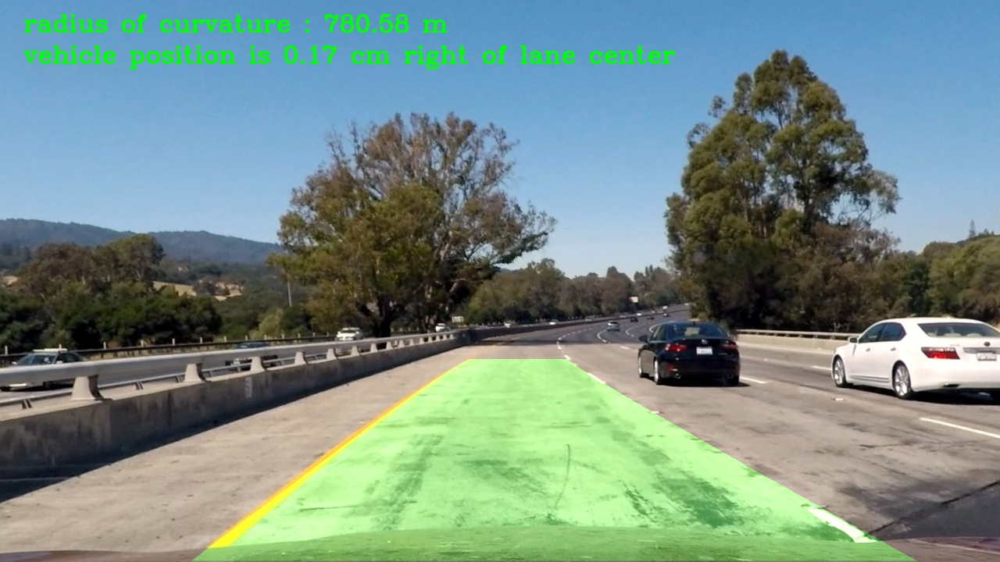

##Writeup
---

###Advanced Lane Finding Project###

***Objective***

The objective of this project is to find lane markings by developing algorithms for autonomous driving. This is advanced lane detecting 
project since the algorithms should be robust enough in finding the lanelines under varying light conditions,curvature of the road 
itself,vehicles on the road , condition of the road etc., The left and right lanes are to be detected from center camera mounted on
dashboard of the vehicle using advanced computer vision techniques.The outcome expected out of the project is to output visual display
of the lane boundaries, numerical estimation of lane curvature and vehicle position from lane center as displayed below.

Test image  |    Output image
:----------:|:-------------------------:
  |  

The goals / steps of this project are the following:

* Compute the camera calibration matrix and distortion coefficients given a set of chessboard images.
* Apply a distortion correction to raw images.
* Use color transforms, gradients, etc., to create a thresholded binary image.
* Apply a perspective transform to rectify binary image ("birds-eye view").
* Detect lane pixels and fit to find the lane boundary.
* Determine the curvature of the lane and vehicle position with respect to center.
* Warp the detected lane boundaries back onto the original image.
* Output visual display of the lane boundaries and numerical estimation of lane curvature and vehicle position.

##Camera Calibration

**1. Briefly state how you computed the camera matrix and distortion coefficients. Provide an example of a distortion corrected calibration image**

The camera calibration and distortion correction code is contained in the undistort_camera.ipynb file.

Pre-requisite to do camera calibration: It requires calibration images which are already provided as /camera_cal/calibration*.jpg. The images were taken by camera keeping chessboard on flat surface and take from different angle, distance etc., . 
The computational code for camera calibration is divided as 2 steps.

The Step 1 code is 2nd code cell in above IPython notebook file

***Step 1: Read Calibration images,extract corners( 2D image points) and 3D objects points(real chessboard)***

i) Read in all calibration images using glob() API and stored as images.Each chessboard has 9 x 6 corners.

ii)Preparing "object points", which will be the (x, y, z) coordinates of the chessboard corners in the world. Here the  assumption is that the chessboard is fixed on the (x, y) plane at z=0, such that the object points are the same for each calibration image. Thus, objp is just a replicated array of coordinates, and "objpoints" will be appended with a copy of it every time when successfully detect all chessboard corners in a test image.

iii) The chessboard corners(2D image points i,e (x,y) pixel position of corners) for each calibration image is obtained using openCV function cv2.findChessboardCorners.The "imgpoints"  will be appended with the (x, y) pixel position of each of the corners in the image plane with each successful chessboard detection.
The "objpoints" and "imgpoints" are saved as pickled file for later use. 

***Step 2: Camera calibration given object points, image points, and the shape of the grayscale image***

The output objpoints and imgpoints are loaded from pickled file and the used to compute the camera calibration matrix "mtx" and distortion coefficients "dist" using the cv2.calibrateCamera() function. Saved the camera calibration result for later use.

**Apply a distortion correction to raw images**

I applied this distortion correction to the test image './camera_cal/calibration2.jpg' using the cv2.undistort() function and obtained this result. The code is contained under "Apply a distortion correction to raw images " markdown header.

